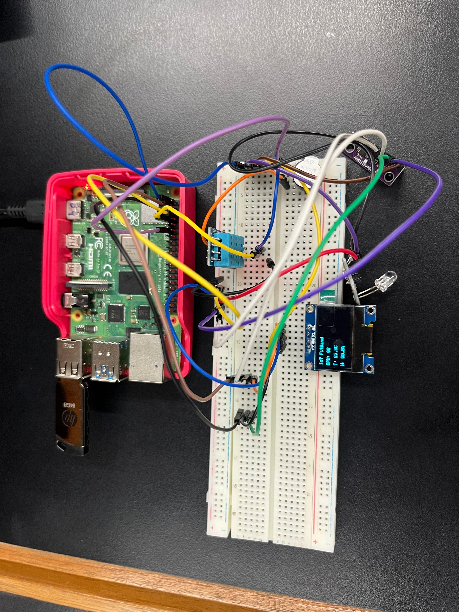
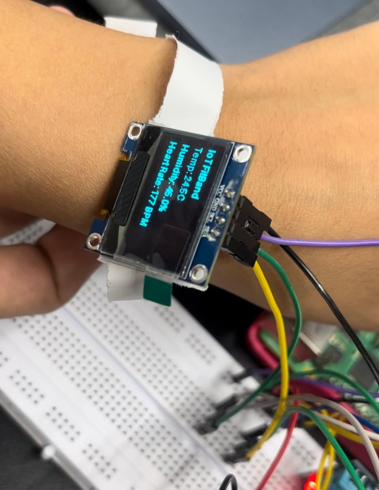
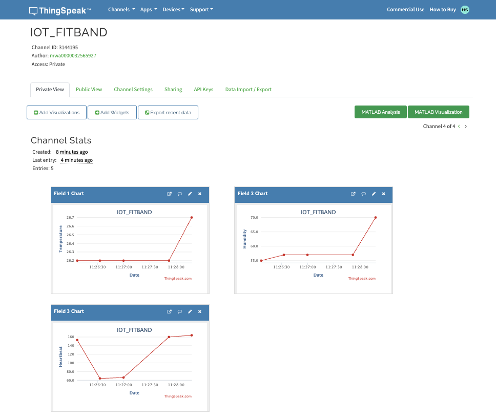

# IoT FitBand: Smart Health Monitoring System Using Raspberry Pi

## Overview

The **IoT FitBand** is a smart health monitoring system designed to continuously measure and record a user’s vital health parameters including **heart rate**, **body temperature**, and **humidity**.
The system uses a **Raspberry Pi 4 Model B** as the main processing unit and integrates a **Pulse Sensor**, **DHT11 sensor**, **ADS1115 Analog-to-Digital Converter**, **OLED display**, and **buzzer**.

Measured values are displayed on an **SSD1306 OLED screen** for local monitoring and uploaded to the **ThingSpeak cloud** for remote visualization and analysis. The buzzer activates automatically whenever readings exceed predefined thresholds.

This project demonstrates the application of **Internet of Things (IoT)** technology in healthcare, enabling continuous, low-cost, and accessible health monitoring.

---

## Features

* Real-time monitoring of heart rate, temperature, and humidity
* OLED display for local visualization
* Cloud integration via ThingSpeak
* Buzzer alerts for abnormal readings
* Low-cost, reliable, and scalable system

---

## System Architecture

### Circuit Diagram

The circuit integrates multiple sensors connected via GPIO and I2C interfaces to the Raspberry Pi.
The layout below shows the connections between all hardware components.



---

## Hardware Components

| Component                        | Description                             | Function                                         |
| -------------------------------- | --------------------------------------- | ------------------------------------------------ |
| **Raspberry Pi 4 Model B**       | Main controller with Wi-Fi capability   | Handles data acquisition and cloud communication |
| **DHT11 Sensor**                 | Digital temperature and humidity sensor | Measures temperature and humidity                |
| **Pulse Sensor**                 | Analog heart rate sensor                | Detects heartbeat and sends analog signal        |
| **ADS1115 ADC**                  | 16-bit Analog-to-Digital Converter      | Converts analog pulse data to digital form       |
| **SSD1306 OLED Display (0.96")** | I2C display module                      | Displays real-time readings                      |
| **Buzzer Module**                | Active 3.3V buzzer                      | Alerts on threshold exceedance                   |
| **Breadboard and Jumper Wires**  | —                                       | Circuit connections                              |

---

## Software Components

| Software                             | Purpose                            |
| ------------------------------------ | ---------------------------------- |
| **Raspberry Pi OS (Debian/Linux)**   | Operating system                   |
| **Python 3**                         | Programming language               |
| **Adafruit CircuitPython Libraries** | Sensor and display interfacing     |
| **ThingSpeak Cloud**                 | IoT data storage and visualization |
| **VNC / SSH / Thonny IDE**           | Coding and debugging               |

---

## Circuit Connections

| Module                     | Raspberry Pi Pin                         | Description              |
| -------------------------- | ---------------------------------------- | ------------------------ |
| **DHT11 Sensor**           | GPIO4 (Pin 7)                            | Data signal              |
| **ADS1115 (I2C)**          | SDA → GPIO2 (Pin 3), SCL → GPIO3 (Pin 5) | I2C communication        |
| **Pulse Sensor**           | A0 input on ADS1115                      | Heartbeat signal         |
| **OLED Display (SSD1306)** | SDA → GPIO2, SCL → GPIO3                 | I2C communication        |
| **Buzzer**                 | GPIO17 (Pin 11)                          | Alert output             |
| **Power**                  | 3.3V and GND                             | Common supply and ground |

---

## Working Principle

1. The **Pulse Sensor** captures heartbeat pulses as analog voltage signals.
2. The **ADS1115 ADC** converts these analog signals into digital values.
3. The **DHT11 Sensor** measures temperature and humidity.
4. The **Raspberry Pi** processes all sensor readings and displays them on the OLED screen.
5. Data is transmitted to the **ThingSpeak IoT Cloud** for real-time visualization.
6. The **Buzzer** activates if readings exceed preset safety thresholds.

---

## System Prototype

The working prototype of the IoT FitBand integrates all sensors and display modules on a breadboard.
It is compact, power-efficient, and easily scalable.

<p align="center">
  
</p>

---

## ThingSpeak Cloud Dashboard

Data from the sensors is uploaded to ThingSpeak every 20 seconds for remote monitoring.
The cloud dashboard provides live graphs for temperature, humidity, and heart rate.

<p align="center">
  
</p>

---

## Algorithm

1. Initialize GPIO and I2C interfaces.
2. Read temperature and humidity from the DHT11 sensor.
3. Read heart rate signal via ADS1115.
4. Calculate beats per minute (BPM).
5. Display values on OLED.
6. Trigger buzzer if readings exceed thresholds.
7. Upload data to ThingSpeak via HTTP API.
8. Repeat at fixed intervals.

---

## ThingSpeak Setup

1. Create an account at [ThingSpeak](https://thingspeak.com).
2. Create a new channel named **IoT FitBand Monitoring System**.
3. Add three fields:

   * Field 1: Temperature (°C)
   * Field 2: Humidity (%)
   * Field 3: Heart Rate (BPM)
4. Copy your **Write API Key** and insert it into your Python script.
5. Run the program to start uploading live data.

---

## Installation and Setup

### Step 1: Update System

```bash
sudo apt update
sudo apt install python3-pip python3-dev libgpiod2 i2c-tools -y
```

### Step 2: Create and Activate Virtual Environment

```bash
python3 -m venv venv
source venv/bin/activate
```

### Step 3: Install Required Libraries

```bash
pip install adafruit-circuitpython-dht
pip install adafruit-circuitpython-ads1x15
pip install adafruit-circuitpython-ssd1306
pip install Adafruit-Blinka
pip install requests
pip install pillow
pip install RPI.GPIO
```

### Step 4: Run the Project

```bash
python3 fitband.py
```

---

## Output

### OLED Display Output

```
IoT FitBand
Temp: 28.5°C
Hum: 52%
Pulse: 78 BPM
```

### ThingSpeak Dashboard

* **Field 1:** Temperature graph
* **Field 2:** Humidity graph
* **Field 3:** Heart Rate graph

---

## Applications

* Real-time fitness and health monitoring
* Remote patient supervision
* Elderly care systems
* IoT-based wearable medical devices

---

## Future Enhancements

* Integration of additional sensors such as **SpO₂** and **ECG**
* Development of a **mobile application** for live data viewing
* Machine learning-based abnormality prediction
* GPS integration for location-aware health tracking

---

## Conclusion

The **IoT FitBand** provides a complete, IoT-based real-time health monitoring solution capable of tracking vital signs and environmental conditions.
Through local display and cloud connectivity, it enables continuous observation, alerts, and long-term data storage.
This project demonstrates how IoT can revolutionize healthcare by providing cost-effective, accessible, and data-driven solutions for personal and remote monitoring.

---
